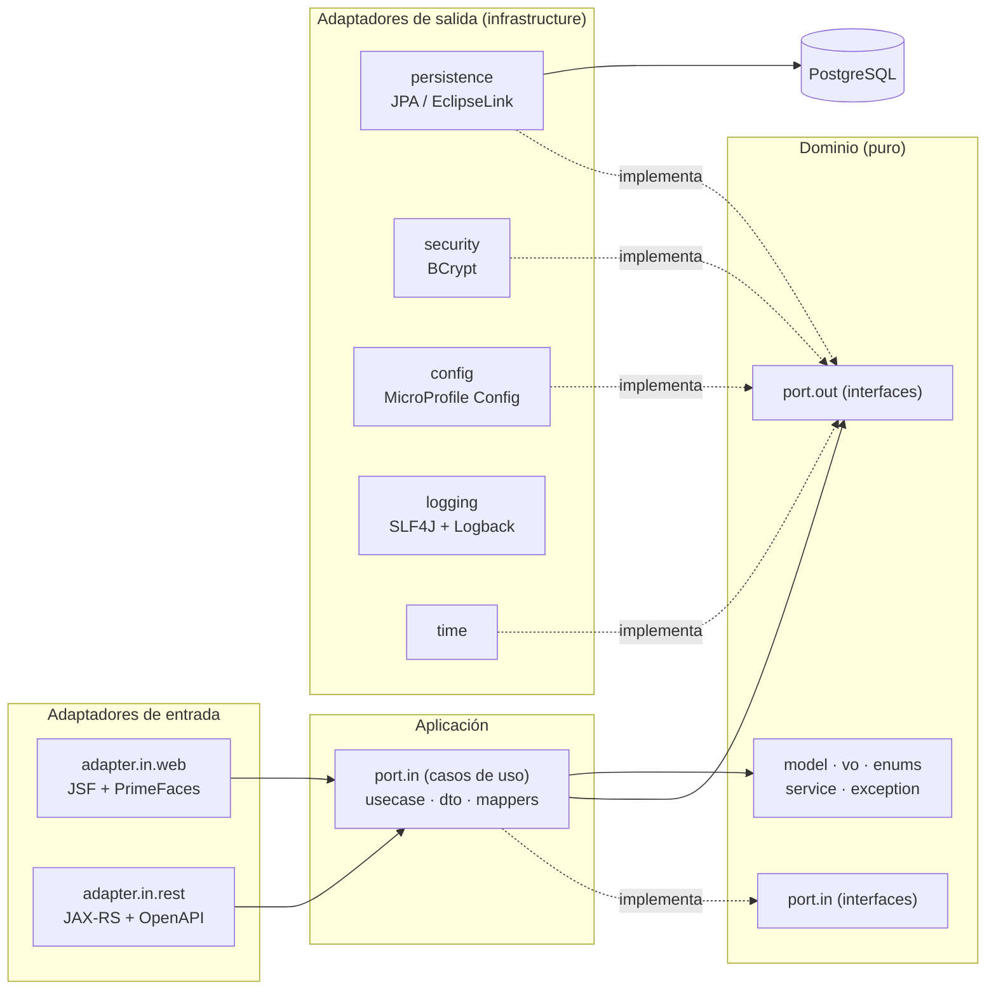
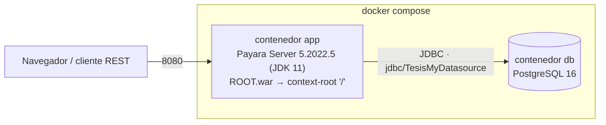
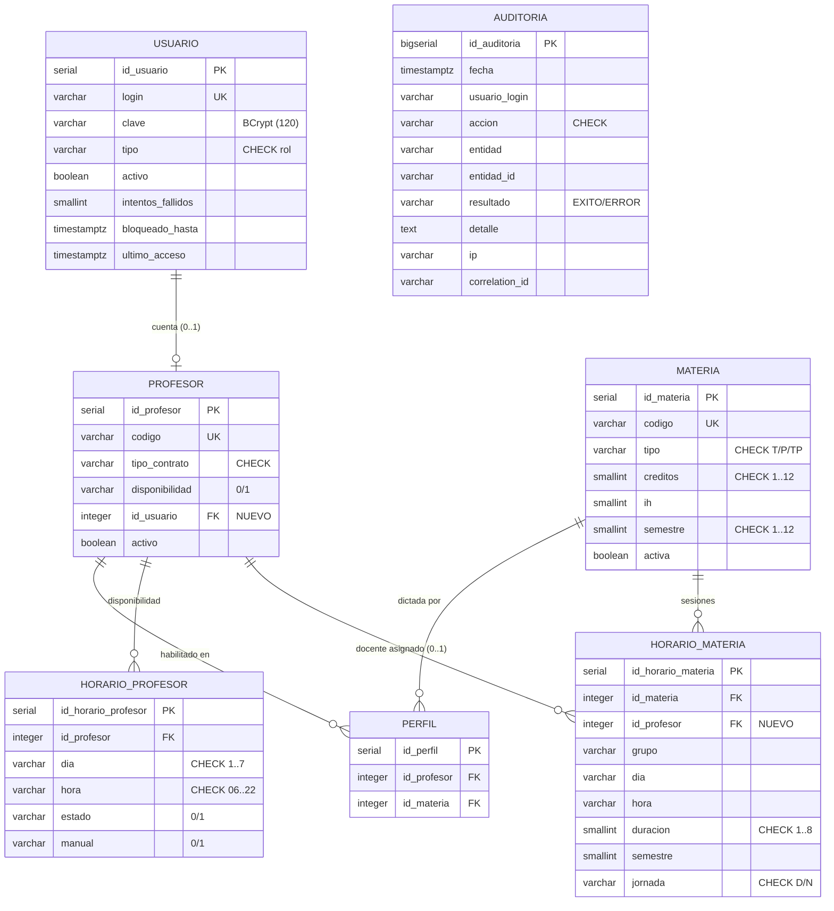
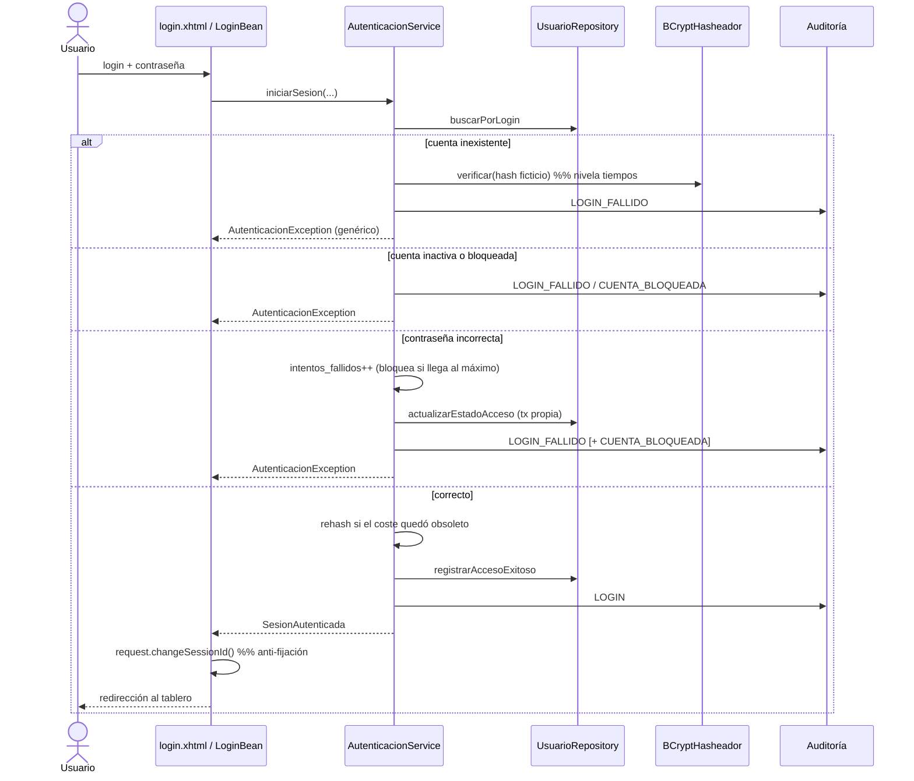
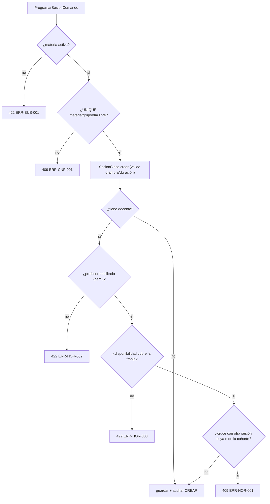

# Sistema de Asignación de Horarios Docentes

> Proyecto de la asignatura **Calidad de Software**.
> Aplicación empresarial Java construida sobre el esquema PostgreSQL original del
> repositorio (`scripst/`), con arquitectura hexagonal, API REST documentada,
> interfaz web JSF/PrimeFaces y un entorno reproducible en Docker.

Todo el sistema vive en `horarios-app/`; la infraestructura de arranque, en
`docker/` y `scripst/`.

---

## Tabla de contenido

1. [Panorama funcional](#1-panorama-funcional)
2. [Arquitectura](#2-arquitectura)
3. [Stack tecnológico](#3-stack-tecnológico)
4. [Modelo de datos](#4-modelo-de-datos)
5. [Flujos funcionales](#5-flujos-funcionales)
6. [Seguridad](#6-seguridad)
7. [Estructura del proyecto](#7-estructura-del-proyecto)
8. [API REST y OpenAPI](#8-api-rest-y-openapi)
9. [Puesta en marcha](#9-puesta-en-marcha)
10. [Pruebas y cobertura](#10-pruebas-y-cobertura)
11. [Configuración](#11-configuración)
12. [Scripts SQL](#12-scripts-sql)
13. [Decisiones de diseño y limitaciones](#13-decisiones-de-diseño-y-limitaciones)
14. [Solución de problemas](#14-solución-de-problemas)

---

## 1. Panorama funcional

Sistema de apoyo a la programación académica de una facultad. Permite administrar
el catálogo de asignaturas, la planta docente, las cuentas de acceso, la
habilitación de cada profesor por materia (*perfil*), su disponibilidad horaria
semanal y la programación de sesiones de clase, detectando automáticamente los
**cruces de horario**.

| Rol | Puede hacer |
|---|---|
| **ADMIN** | Todo, incluida la administración de cuentas de usuario. |
| **COORDINADOR** | Gestión académica completa (materias, profesores, perfiles, disponibilidad, sesiones) y consulta de auditoría. |
| **PROFESOR** | Consulta de horarios y del tablero. |
| **CONSULTA** | Solo lectura del tablero y de los horarios. |

Funciones principales:

- **Autenticación** con bloqueo de cuenta por fuerza bruta y auditoría.
- **CRUD** de materias, profesores y usuarios (paginado y con filtros).
- **Perfiles**: qué materias está habilitado a dictar cada profesor (M:N).
- **Disponibilidad**: rejilla semanal día × hora por profesor.
- **Programación de sesiones** con validación en cascada:
  el profesor está habilitado (perfil), tiene disponibilidad en la franja y no
  se cruza con otra sesión suya ni de la misma cohorte.
- **Tablero** con indicadores y gráficas (sesiones por día/semestre, materias
  por tipo, profesores por contrato) y **detección de conflictos**.
- **Auditoría**: traza de cada operación y de los eventos de seguridad.

---

## 2. Arquitectura

### 2.1 Estilo

**Arquitectura Hexagonal (Puertos y Adaptadores)** + **Clean Architecture**.
El dominio no conoce ni JPA, ni JSF, ni JAX-RS: solo interfaces (*puertos*). La
infraestructura y los adaptadores de entrada implementan esos puertos.



### 2.2 Regla de dependencias

`adapter.in.*` → `application` → `domain` ← `infrastructure`.
Las flechas apuntan **siempre** hacia el dominio. El dominio no importa nada de
`javax.*` salvo, de forma acotada, `javax.enterprise` / `javax.transaction` en la
capa de aplicación (anotaciones ligeras de CDI/JTA sobre los casos de uso).

### 2.3 Patrones de diseño aplicados

| Patrón | Dónde |
|---|---|
| Puertos y adaptadores | `domain.port.in` / `domain.port.out` + implementaciones |
| Repository | `*RepositoryPort` + `*RepositoryJpaAdapter` |
| Adapter | `adapter.in.web`, `adapter.in.rest`, adaptadores JPA |
| DTO / Assembler | `application.dto.*` + factorías `Vista.de(...)` y `*JpaMapper` |
| Factory Method | `Materia.crear()` / `Materia.reconstruir()`, etc. |
| Builder | `RegistroAuditoria.builder(...)` |
| Strategy | `DetectorConflictosHorario`, `ValidadorProgramacionSesion` |
| Value Object | `Codigo`, `Franja`, `Credenciales`, `ClaveHash`, `PoliticaBloqueo` |
| Dependency Injection | CDI en toda la aplicación |
| Facade | `TrazaAuditoria`, `Autorizador` (transversales de aplicación) |
| Producer | `ProductorServiciosDominio`, `ProductorLogger` |

### 2.4 Despliegue



- El `Dockerfile` es **multi-stage**: etapa Maven que compila, ejecuta las 131
  pruebas y **exige la cobertura mínima** (`jacoco:check`); etapa Payara que
  despliega el `ROOT.war` y registra el *connection pool* / *datasource*
  `jdbc/TesisMyDatasource` mediante `post-boot-commands.asadmin`.
- La base de datos se inicializa una única vez (al crear el volumen) con
  `docker/initdb/` (esquema optimizado + semilla amplia).

---

## 3. Stack tecnológico

### Lenguajes

| Lenguaje | Uso | Versión |
|---|---|---|
| **Java** | Backend, dominio, adaptadores | 11 (`maven.compiler.release=11`) |
| **SQL** (PostgreSQL) | Esquema, restricciones, semilla, migración | — |
| **XHTML / Facelets** | Vistas JSF | JSF 2.3 |
| **JavaScript** | Realces de UI (ripple, contadores, extender de gráficas) | ES5, sin dependencias |
| **CSS3** | Tema propio (sombras, animaciones, *responsive*) | — |

### Plataforma y frameworks

| Componente | Tecnología | Versión |
|---|---|---|
| Servidor de aplicaciones | **Payara Server (full)** | 5.2022.5 · JDK 11 |
| Plataforma | Jakarta EE 8 (`javax.*`) — `javaee-api` | 8.0.1 (*provided*) |
| Vista web | **JSF (Mojarra)** + **PrimeFaces** | JSF 2.3 · PrimeFaces 8.0 |
| Persistencia | **JPA** / EclipseLink (incluido en Payara) | JPA 2.2 |
| API REST | **JAX-RS** (Jersey, incluido en Payara) | 2.1 |
| Documentación API | **MicroProfile OpenAPI** + Swagger UI | MP OpenAPI 2.0 · swagger-ui 4.15.5 |
| Configuración | **MicroProfile Config** | 2.0 |
| Inyección | **CDI** (Weld, incluido en Payara) | 2.0 |
| Transacciones / validación | JTA · Bean Validation | — |

### Librerías puntuales (empaquetadas en el WAR)

| Librería | Propósito | Versión |
|---|---|---|
| `org.slf4j:slf4j-api` | Fachada de logging | 1.7.36 |
| `ch.qos.logback:logback-classic` | Backend de logging (3 ficheros: app/warn/error) | 1.2.13 |
| `at.favre.lib:bcrypt` | Hash de contraseñas (BCrypt, verificación en tiempo constante) | 0.10.2 |
| `org.postgresql:postgresql` | Driver JDBC (en `domain1/lib` del dominio Payara) | 42.7.4 |

### Herramientas de construcción y prueba

| Herramienta | Propósito | Versión |
|---|---|---|
| **Apache Maven** | Construcción | 3.9 (imagen `maven:3.9-eclipse-temurin-11`) |
| **Docker** / Docker Compose | Entorno reproducible | — |
| **JUnit 5 (Jupiter)** | Framework de pruebas | 5.10.2 |
| **Mockito** (+ `mockito-junit-jupiter`) | Dobles de prueba | 4.11.0 |
| **AssertJ** | Aserciones fluidas | 3.24.2 |
| **JaCoCo** | Cobertura + *quality gate* en el build | 0.8.11 |
| `maven-war-plugin` / `maven-compiler-plugin` / `maven-surefire-plugin` / `maven-dependency-plugin` | Ciclo de vida | 3.4.0 / 3.11.0 / 3.2.5 / 3.6.1 |

### Base de datos

| Motor | Versión | Detalles |
|---|---|---|
| **PostgreSQL** | 16 | Base `Sistema_Notas`; extensión `pgcrypto` (hashes BCrypt en la semilla); *datasource* JTA `jdbc/TesisMyDatasource` (pool 8–64, validación *meta-data*). |

---

## 4. Modelo de datos

Se conservan **las 6 tablas y los nombres de columna del script original**
(`scripst/1. Creacion de tablas base.sql`). Sobre ellas se aplican optimizaciones
profesionales y se añade una tabla nueva de auditoría.



### Optimizaciones aplicadas (mismas tablas y columnas)

- `usuario.clave` ampliada a **120** caracteres (BCrypt = 60) y `UNIQUE(login)`.
- Tipos correctos: `varchar(1)` → **`smallint`** en `creditos`, `ih`, `semestre`,
  `duracion`.
- **`CHECK`** para todos los enumerados (rol, tipo de materia, contrato, día,
  hora, jornada, estado, acción de auditoría…).
- **`UNIQUE`** en las claves naturales (`codigo` de materia y profesor).
- Columnas de auditoría `fecha_creacion` / `fecha_modificacion` + **trigger**.
- Control de acceso: `activo`, `intentos_fallidos`, `bloqueado_hasta`,
  `ultimo_acceso`.
- **Índices** en todas las claves foráneas y en los patrones de consulta
  (`horario_materia(semestre, jornada, dia, hora)`,
  `horario_profesor(id_profesor, dia, estado)`, `auditoria(fecha DESC)`, …).
- **Tablas nuevas**: `auditoria` (indexada por fecha, usuario, acción y entidad).
- **Columnas nuevas**: `profesor.id_usuario` (enlaza docente ↔ cuenta) y
  `horario_materia.id_profesor` (docente de la sesión) — resuelven los dos vacíos
  del modelo original.

---

## 5. Flujos funcionales

### 5.1 Autenticación y sesión



La sesión se mantiene en un `@SessionScoped SesionUsuarioBean`; un `Filter`
protege `/app/*` y redirige a `login.xhtml` si no hay sesión. El *logout*
invalida la sesión HTTP y audita `LOGOUT`.

### 5.2 Programación de una sesión de clase



### 5.3 CRUD (materias / profesores / usuarios)

`listar` (paginado + filtro) · `obtener` · `crear` (verifica clave natural única)
· `actualizar` · `cambiarEstado` (activar/desactivar) · `eliminar`.
Cada mutación exige rol adecuado (`Autorizador`) y deja traza (`TrazaAuditoria`).
Los mensajes de resultado se muestran en pantalla mediante `p:messages` y
`p:growl` (banner en la página + notificación flotante).

### 5.4 Detección de conflictos

`DetectorConflictosHorario` recorre las sesiones y reporta:

- **DOCENTE_SOLAPADO**: un mismo docente con dos sesiones cuyos intervalos se
  intersectan.
- **COHORTE_SOLAPADA**: misma cohorte (`semestre` + `jornada` + `grupo`) con dos
  sesiones solapadas.

Visible en el tablero y en la pantalla *Horario / Conflictos*; la semilla incluye
casos intencionales de ambos tipos.

---

## 6. Seguridad

| Vector | Medida |
|---|---|
| Contraseñas | **BCrypt** (coste 12, OWASP), verificación en tiempo constante, *rehash* transparente si el coste guardado quedó por debajo del configurado. |
| Fuerza bruta | Bloqueo temporal de la cuenta tras *N* intentos (config.); el contador persiste en transacción propia aunque el login termine en excepción. |
| Enumeración de cuentas | Mensaje de error genérico + verificación contra un hash ficticio cuando la cuenta no existe (nivela tiempos). |
| Fijación de sesión | `request.changeSessionId()` al autenticar. |
| Inyección SQL | 100 % consultas parametrizadas (JPA/JPQL); sin concatenación. |
| Autorización | Comprobación de rol en **cada** caso de uso mutador + `Filter` en la capa web + `@SecurityRequirement` en la API. |
| Cabeceras | `X-Content-Type-Options`, `X-Frame-Options`, `Referrer-Policy`, `Content-Security-Policy`. |
| API REST | HTTP Basic obligatorio (salvo `POST /api/auth/login`); respeta cuenta activa y bloqueo. |
| Trazabilidad | Tabla `auditoria` + `correlationId` en el MDC de logging por petición. |
| Datos sensibles | El hash de la contraseña **nunca** se serializa (los DTO de salida no lo exponen). |

---

## 7. Estructura del proyecto

```
CalidadSoftware/
├── docker/
│   ├── Dockerfile                     multi-stage: build+tests+gate → Payara
│   ├── post-boot-commands.asadmin     pool + datasource jdbc/TesisMyDatasource
│   └── initdb/
│       ├── 01-schema.sql              esquema optimizado
│       └── 02-seed.sql               semilla amplia
├── docker-compose.yml                 servicios db + app
├── scripst/
│   ├── 1. Creacion de tablas base.sql   (original, referencia)
│   ├── 2. Datos semilla.sql             (= docker/initdb/02-seed.sql)
│   └── 3. Mejoras y optimizacion.sql    migración de un esquema antiguo
└── horarios-app/
    ├── pom.xml
    └── src/
        ├── main/
        │   ├── java/com/tesiscalidad/horarios/
        │   │   ├── domain/
        │   │   │   ├── model/         Usuario, Materia, Profesor, Perfil,
        │   │   │   │                  DisponibilidadProfesor, SesionClase,
        │   │   │   │                  RegistroAuditoria
        │   │   │   ├── vo/            Codigo, Franja, Credenciales, ClaveHash,
        │   │   │   │                  PoliticaBloqueo
        │   │   │   ├── enums/         RolUsuario, TipoMateria, TipoContrato,
        │   │   │   │                  DiaSemana, Jornada, EstadoFranja, …
        │   │   │   ├── exception/     DominioException + jerarquía, CodigoError
        │   │   │   ├── service/       DetectorConflictosHorario,
        │   │   │   │                  ValidadorProgramacionSesion
        │   │   │   ├── support/       Preconditions, Paginacion, Pagina, Reglas
        │   │   │   └── port/out/      *RepositoryPort, HasheadorContrasenaPort,
        │   │   │                      RelojPort, ParametrosAplicacionPort, …
        │   │   ├── application/
        │   │   │   ├── port/in/       Gestionar*UseCase, Consultar*UseCase,
        │   │   │   │                  AutenticacionUseCase
        │   │   │   ├── usecase/       *Service (implementaciones)
        │   │   │   ├── dto/           comandos + proyecciones de lectura
        │   │   │   └── support/       TrazaAuditoria, Autorizador
        │   │   ├── infrastructure/
        │   │   │   ├── persistence/   entity/ · mapper/ · adapter/
        │   │   │   ├── security/      BCryptHasheador
        │   │   │   ├── config/        ParametrosAplicacion, ProductorServiciosDominio
        │   │   │   ├── logging/       ProductorLogger
        │   │   │   └── time/          RelojSistema
        │   │   └── adapter/
        │   │       ├── in/web/        *Bean (@ViewScoped), filtros, converter,
        │   │       │                  PaginaLazyModel, Mensajes
        │   │       └── in/rest/       *Resource, JaxRsApplication,
        │   │                          security/ (Basic), mapper/ (exception)
        │   ├── resources/
        │   │   ├── META-INF/persistence.xml
        │   │   ├── META-INF/microprofile-config.properties
        │   │   └── logback.xml
        │   └── webapp/
        │       ├── login.xhtml · index.xhtml · swagger-ui/
        │       ├── app/              dashboard, materias, profesores, usuarios,
        │       │                     perfiles, disponibilidad, sesiones,
        │       │                     horario, auditoria
        │       ├── error/            403 · 404 · 500
        │       ├── resources/css/app.css · resources/js/app.js
        │       └── WEB-INF/          web.xml, beans.xml, glassfish-web.xml,
        │                             plantilla/, tesis.taglib.xml, tags/
        └── test/java/…               131 pruebas (JUnit 5 + Mockito + AssertJ)
```

---

## 8. API REST y OpenAPI

Base: `http://localhost:8080/api` · Autenticación **HTTP Basic**.
Especificación **OpenAPI 3.0** en `http://localhost:8080/openapi`;
**Swagger UI** en `http://localhost:8080/swagger-ui/`.

| Recurso | Endpoints (resumen) |
|---|---|
| `Autenticacion` | `POST /auth/login` · `GET /auth/me` |
| `Materias` | `GET /materias` · `GET /materias/{id}` · `GET /materias/activas` · `POST` · `PUT /{id}` · `PUT /{id}/estado` · `DELETE /{id}` |
| `Profesores` | análogo a materias + `GET /profesores/activos` |
| `Usuarios` | CRUD + `PUT /{id}/contrasena` · `PUT /{id}/estado` · `PUT /{id}/desbloqueo` |
| `Perfiles` | `GET/POST/DELETE /profesores/{id}/perfiles[/{idMateria}]` · `GET .../disponibles` |
| `Disponibilidad` | `GET/POST/DELETE /profesores/{id}/disponibilidad` · `POST .../rejilla` · `DELETE .../todo` |
| `Sesiones` | CRUD + `PUT /{id}/docente/{idProfesor}` · `DELETE /{id}/docente` |
| `Horario` | `GET /horario/profesor/{id}` · `/semestre/{n}` · `/conflictos` · `/tablero` |
| `Auditoria` | `GET /auditoria` (filtros por usuario y acción) |

Errores con cuerpo JSON estable `{ codigo, mensaje, ruta }` y códigos del
catálogo (`ERR-VAL-001`, `ERR-CNF-001`, `ERR-HOR-002`, `ERR-SEC-002`, …).

---

## 9. Puesta en marcha

### Requisitos

- Docker + Docker Compose. No hace falta Java ni Maven instalados: todo ocurre
  dentro de los contenedores.

### Comandos

```bash
cd CalidadSoftware

docker compose up -d --build      # construye (con pruebas + gate) y levanta
docker compose logs -f app        # seguir el arranque
docker compose down               # detener
docker compose down -v            # detener y BORRAR datos (recarga la semilla)
```

### URLs

| Recurso | URL | Acceso |
|---|---|---|
| Aplicación web (login) | http://localhost:8080/ | ver cuentas |
| Swagger UI | http://localhost:8080/swagger-ui/ | — |
| OpenAPI (spec) | http://localhost:8080/openapi | — |
| API REST | http://localhost:8080/api | HTTP Basic |
| Consola Payara | https://localhost:4848 | `admin` / `admin` |
| PostgreSQL | `localhost:5432` | `Sistema_Notas` / `postgres` / `sebastian94` |

### Cuentas de prueba (semilla)

| Login | Clave | Rol / estado |
|---|---|---|
| `admin`, `dbadmin` | `Admin*2024` | ADMIN |
| `lgomez`, `rdiaz`, `mvega` | `Coord*2024` | COORDINADOR |
| `docente01` … `docente25` | `Prof*2024` | PROFESOR (con cuenta) |
| `consulta`, `auditor1`, `auditor2`, `decano`, `secretaria` | `Consulta*2024` | CONSULTA |
| `bloqueado` | `Prof*2024` | PROFESOR — con bloqueo temporal activo |
| `inactivo`, `invitado`, `retirado` | — | cuentas inactivas |
| `nuevo` | `Prof*2024` | PROFESOR — nunca ha iniciado sesión |

Volumen de la semilla: **40 usuarios · 44 materias · 35 profesores · ~140
perfiles · ~2.600 franjas de disponibilidad · ~125 sesiones · 30 registros de
auditoría**, con conflictos de horario intencionales.

---

## 10. Pruebas y cobertura

```bash
cd horarios-app
mvn test        # 131 pruebas unitarias (JUnit 5 + Mockito + AssertJ)
mvn verify      # además, jacoco:check — FALLA el build si baja la cobertura
```

El *quality gate* se aplica sobre **todo el código unit-testable** (dominio +
aplicación + adaptadores de infraestructura puros: mappers, seguridad, tiempo,
configuración). Se excluyen del gate las clases que solo se pueden ejercitar con
un contenedor Jakarta EE en marcha (entidades y adaptadores JPA, beans JSF,
recursos JAX-RS), cubiertas por la verificación *end-to-end* del despliegue.

| Métrica | Umbral (build) | Valor actual |
|---|---|---|
| Línea | ≥ 95 % | **97,8 %** |
| Rama | ≥ 80 % | **81,0 %** |
| Método | ≥ 94 % | **96,2 %** |

Reporte HTML: `horarios-app/target/site/jacoco/index.html`.
El `Dockerfile` ejecuta `mvn verify` en la etapa de build: **si la cobertura o
las pruebas fallan, la imagen no se construye**.

---

## 11. Configuración

`src/main/resources/META-INF/microprofile-config.properties`. Cada clave admite
*override* por variable de entorno (mayúsculas + `_`).

| Clave | Env | Defecto | Descripción |
|---|---|---|---|
| `app.security.bcrypt-cost` | `APP_SECURITY_BCRYPT_COST` | 12 | Coste de BCrypt. |
| `app.security.max-login-attempts` | `APP_SECURITY_MAX_LOGIN_ATTEMPTS` | 5 | Intentos antes de bloquear. |
| `app.security.lockout-minutes` | `APP_SECURITY_LOCKOUT_MINUTES` | 30 | Duración del bloqueo. |
| `app.security.session-timeout-minutes` | `APP_SECURITY_SESSION_TIMEOUT_MINUTES` | 30 | Timeout de sesión. |
| `app.security.password-min-length` | `APP_SECURITY_PASSWORD_MIN_LENGTH` | 8 | Longitud mínima de contraseña. |
| `app.pagination.default-size` | `APP_PAGINATION_DEFAULT_SIZE` | 25 | Tamaño de página por defecto. |
| `app.pagination.max-size` | `APP_PAGINATION_MAX_SIZE` | 200 | Tope de tamaño de página. |
| `app.audit.enabled` | `APP_AUDIT_ENABLED` | true | Activa/desactiva la escritura de auditoría. |

Conexión a base de datos: definida en `docker/post-boot-commands.asadmin`
(`ServerName=db`, `PortNumber=5432`, `DatabaseName=Sistema_Notas`, pool 8–64,
`isconnectvalidatereq=true`, `validationmethod=meta-data`).

---

## 12. Scripts SQL

| Fichero | Contenido |
|---|---|
| `scripst/1. Creacion de tablas base.sql` | Esquema **original** (referencia, no se ejecuta). |
| `docker/initdb/01-schema.sql` | Esquema **optimizado** (índices, CHECK, auditoría, triggers). |
| `scripst/2. Datos semilla.sql` = `docker/initdb/02-seed.sql` | **Semilla amplia** e idempotente. |
| `scripst/3. Mejoras y optimizacion.sql` | Migración de una instalación con el esquema antiguo al optimizado. |

`docker/initdb/` se ejecuta automáticamente **solo al crear** el volumen de
PostgreSQL (primer `up`). Para recargar: `docker compose down -v && docker compose up -d`.

---

## 13. Decisiones de diseño y limitaciones

- **PrimeFaces 8** no incluye `p:tag`, `p:avatar`, `p:badge`, `p:card` (son de
  PF 10+). Se sustituyen por una *taglib* Facelets propia
  (`WEB-INF/tesis.taglib.xml` → `t:pill`, `t:badge`) + CSS, y `p:card` → `p:panel`.
  Temas disponibles: `nova-light` / `nova-colored` / `nova-dark`, conmutables
  desde la barra superior.
- La plantilla usa `ui:composition` / `ui:insert` — **mecanismo nativo de JSF**,
  no una librería de plantilla de terceros.
- El *gate* de cobertura no incluye entidades/adaptadores JPA ni la capa web/REST
  porque su prueba unitaria aislada aporta poco valor frente a la verificación de
  integración del despliegue; esas capas se validan ejecutando la aplicación real
  contra PostgreSQL (flujos CRUD, validación, autorización, bloqueo).
- El dominio original no vinculaba `usuario`↔`profesor` ni registraba el docente
  de cada sesión. Se añadieron `profesor.id_usuario` y `horario_materia.id_profesor`.

---

## 14. Solución de problemas

| Síntoma | Causa / solución |
|---|---|
| `http://localhost:8080/` no responde | El arranque de Payara tarda ~20–40 s. `docker compose logs -f app` hasta ver `ROOT was successfully deployed`. |
| La semilla no cambia tras editarla | `docker/initdb/` solo corre al **crear** el volumen. `docker compose down -v && docker compose up -d`. |
| Cambios en el código no se reflejan | `payara/server-full` despliega en el arranque; reconstruir: `docker compose up -d --build`. |
| `BUILD FAILURE` por cobertura | Añadir/ajustar pruebas hasta superar los umbrales de `jacoco:check` (`pom.xml`, propiedades `coverage.*`). |
| Puerto 8080/5432 ocupado | Ajustar el mapeo de puertos en `docker-compose.yml`. |
